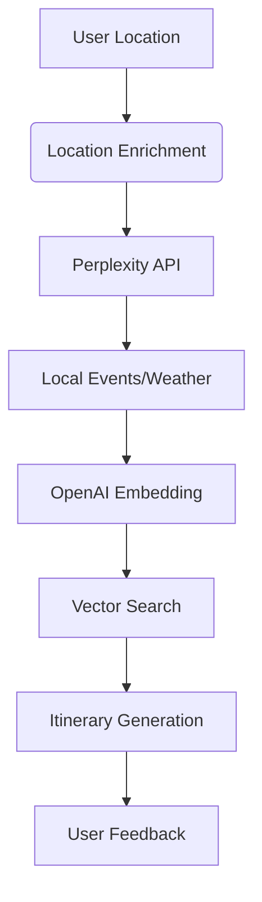
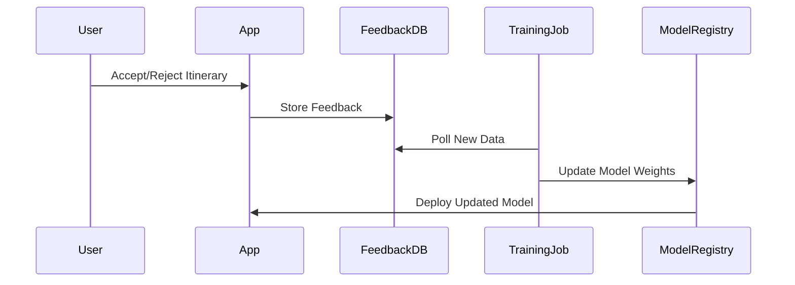

# AI Travel Assistant - Technical Documentation

## 1. Project Setup & Infrastructure

### Initialize Next.js App

```bash
npx create-next-app@latest --ts --app --tailwind
npm install @supabase/supabase-js @supabase/ssr openai perplexityai
```

### Configure Supabase

Create `supabase/database.types.ts` with:

```sql
create table profiles (
  id uuid references auth.users primary key,
  travel_preferences jsonb,
  created_at timestamp with time zone default now()
);

create table itineraries (
  id serial primary key,
  user_id uuid references profiles(id),
  location text,
  itinerary jsonb,
  accepted boolean,
  feedback jsonb,
  created_at timestamp with time zone default now()
);

create index idx_itineraries_user on itineraries(user_id);
```

## 2. User Authentication & Profiles

### Implement Supabase Auth

```tsx
// app/auth/provider.tsx
import { createClient } from "@supabase/supabase-js";

export const supabase = createClient(
  process.env.NEXT_PUBLIC_SUPABASE_URL!,
  process.env.NEXT_PUBLIC_SUPABASE_ANON_KEY!
);
```

### Profile Management Component

```tsx
// app/account/profile-form.tsx
"use client";
import { updateProfile } from "./actions";

export default function ProfileForm({ preferences }) {
  return (
    <form action={updateProfile}>
      <input name="budget" defaultValue={preferences?.budget} />
      <select name="travelStyle" defaultValue={preferences?.travelStyle}>
        <option value="adventure">Adventure</option>
        <option value="luxury">Luxury</option>
      </select>
      <button type="submit">Save Preferences</button>
    </form>
  );
}
```

## 3. AI Itinerary Generation

### RAG System Architecture



### Itinerary Generation Service

```typescript
// lib/ai/itinerary.ts
import OpenAI from "openai";

export async function generateItinerary(location: string, preferences: any) {
  const openai = new OpenAI(process.env.OPENAI_API_KEY!);

  const response = await openai.chat.completions.create({
    model: "gpt-4-turbo",
    messages: [
      {
        role: "system",
        content: `Generate travel itinerary considering: ${JSON.stringify(
          preferences
        )}`,
      },
    ],
    tools: [
      {
        type: "function",
        function: {
          name: "format_itinerary",
          parameters: {
            type: "object",
            properties: {
              days: {
                type: "array",
                items: {
                  type: "object",
                  properties: {
                    morning: { type: "string" },
                    afternoon: { type: "string" },
                    evening: { type: "string" },
                  },
                },
              },
            },
          },
        },
      },
    ],
  });

  return JSON.parse(
    response.choices[0].message.tool_calls[0].function.arguments
  );
}
```

## 4. Feedback & Learning System

### Reinforcement Learning Setup

```typescript
// lib/ai/feedback.ts
export async function processFeedback(
  userId: string,
  acceptedItineraryId: number
) {
  const { data: itinerary } = await supabase
    .from("itineraries")
    .select("*")
    .eq("id", acceptedItineraryId)
    .single();

  await supabase
    .from("profiles")
    .update({
      travel_preferences: {
        preferredActivities: [
          ...new Set([
            ...(user.preferredActivities || []),
            ...extractActivities(itinerary),
          ]),
        ],
      },
    })
    .eq("id", userId);
}
```

## 5. Dashboard Implementation

### Itinerary Dashboard Component

```tsx
// app/dashboard/page.tsx
import { createClient } from "@/lib/supabase/server";

export default async function Dashboard() {
  const supabase = createClient();
  const { data } = await supabase
    .from("itineraries")
    .select("*")
    .order("created_at", { ascending: false });

  return (
    <div className="grid grid-cols-1 md:grid-cols-3 gap-4">
      {data?.map((itinerary) => (
        <ItineraryCard
          key={itinerary.id}
          itinerary={itinerary}
          onAccept={() => handleFeedback(itinerary.id, true)}
          onReject={() => handleFeedback(itinerary.id, false)}
        />
      ))}
    </div>
  );
}
```

## 6. Deployment & Optimization

### Environment Variables

```text
NEXT_PUBLIC_SUPABASE_URL=your-supabase-url
NEXT_PUBLIC_SUPABASE_ANON_KEY=your-anon-key
OPENAI_API_KEY=your-openai-key
PERPLEXITY_API_KEY=your-perplexity-key
```

### Performance Optimization

- Implement SWR for data fetching
- Use Supabase Realtime for instant updates
- Cache common AI responses with Redis
- Enable Edge Functions for feedback processing

## Key Architecture Considerations

### AI Training Pipeline



### Security Measures

- Row Level Security (RLS) in Supabase
- API rate limiting
- Content moderation layer for AI outputs
- Encryption at rest for user preferences
